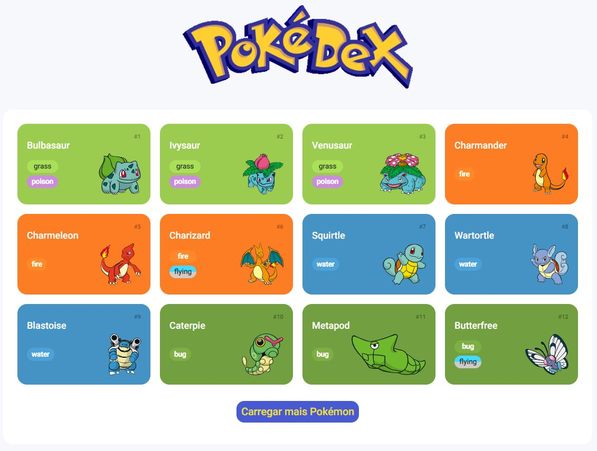

<h1 align='center' font-weight="800">Pokédex 🌟</h1>

<h1 align='center'> Projeto criado durante a Trilha Javascript do bootcamp Orange tech +, uma parceria do Inter e DIO.</h1>

  

## 🛠️ Tecnologias
- HTML
- CSS
- Javascript
- Integração com a PokeApi
- Git e Github

## ✨ Contato
keniacunha100@gmail.com
